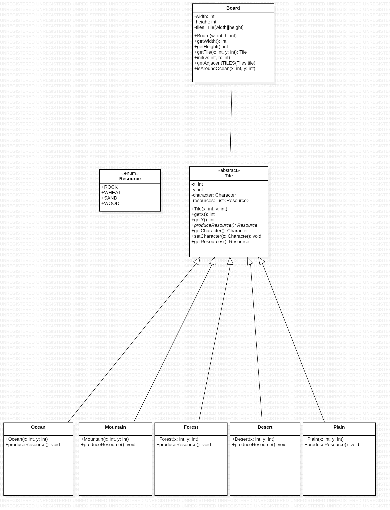

# l2s4-projet-2021

# Equipe

- Blaise Antonio IRADUKUNDA
- Alpha Barry
- Sabir	Riad	
- Mahamat-Ahmat-Ismail	DAWIA

# Sujet

[Le sujet 2021](https://www.fil.univ-lille1.fr/portail/index.php?dipl=L&sem=S4&ue=Projet&label=Documents)

# livrable

## Livrable 1

### Atteinte des objectifs
pour le livrable1,le but etait de modeliser les personnages tout en trouvant les liaisons entre les personnages du jeu de guerre et du jeu agricole .
Ainsi, nous avions modeliser une classe abstraite " character" qui  contient les points communs (methodes et attributs) des classes Army et Worker qui a leurs tours contiennent chacun des methodes specifiques à eux.

### Difficultés restant à résoudre
nous n'avons pas eu des difficultés dans cette partie.

## Livrable 2

### Atteinte des objectifs
 l'objectif principale étant la  modelisation du plateau du jeu,nous avons proceder comme suit :
 une classe board mettant en place les attributs et les methodes necessaires pour construire la forme du plateau; 
 une classe tuile et tout les types correspondant nous permettant egalement de positionner les personnages sur les tuiles. 

### Difficultés restant à résoudre
Nous n'avons pas eu de  difficultés aussi

## Livrable 3

### Atteinte des objectifs

### Difficultés restant à résoudre

## Livrable 4

### Atteinte des objectifs

### Difficultés restant à résoudre

# Journal de bord
***********LE PROJET ET SES OBJECTIFS *************

Dans ce projet , l'objectif est d'implementer  deux jeux  grace a une  modelisation commune  .
en effet les regles etablit diffèrent d'un jeu a l'autre .
par consequent , le but primordial c'est de reussir a implementer le mieux possibble pour que ce dernier
soit reutilisable pour creer des nouveaux jeux.
pour realisé cela nous avons proceder comme suit :
-la modelisation 
-l'implementation
-la compilation 
-les test 
  *************************************
premierement pour bien commencer  notre projet  nous avons créé un dossier src, dans lequel nous avons creer des diffrents dossiers
pour different paquetages .
un dossier a été créé pour le package Game,contenant la classe Board.java Et Game.java.
Ensuite, le package game.charactere contiendra les 3 classes suivantes: Army.java, Character.java, Worker.java. 
Nous avons également un package game.charactere.exception, qui declenche une exception de la classe ArmySizeException.java.
Dans le package game.player,nous avons AgriculturePlayer.java, Player.java et WarPlayer.java. 
Le package game.ressource contiendra a son tour la classe Resource.java .
Cependant , nous avons procedé de la même manière pour game.tile qui accueilleras  les diffrentes  classes du paquetage game.tile.

## Semaine 1

## Semaine 2

## Semaine 3

## Semaine 4

## Semaine 5

## Semaine 6

## Semaine 7

## Semaine 8

## Semaine 9

## Semaine 10

## Semaine 11

## Semaine 12
